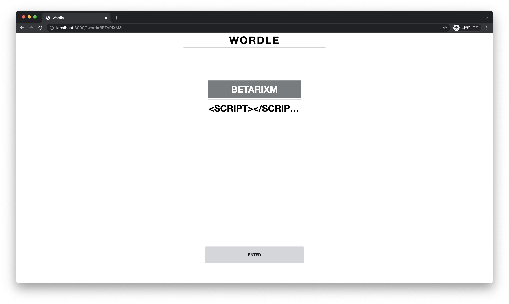

# XSS Exercise

 

It is XSS demo page used for "[POSTECH](https://postech.ac.kr) Hacking Camp". — Inspired by WORDLE

## Objective

Students could get answer from admin browser's cookie. Admin browser checks user's request for each request.
